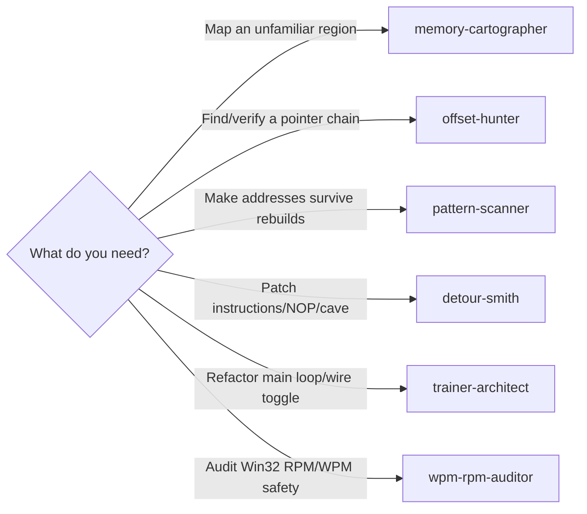

# AssaultCube Trainer Agent Family — Repo Level

This repo (`SchwartzKamel/assaultcube_simple`) bundles a family of six specialized Copilot CLI agents (`~/.copilot/agents/` siblings) that work together to author and maintain an external trainer for AssaultCube 1.2.0.2. Each agent is invocable by name or picked from the `/agents` menu. The agents decompose the memory-hacking workflow: map memory layouts, find pointer chains, swap addresses for resilient signature scans, patch instructions, wire toggle logic, and audit Win32 memory-I/O safety.

## Verification tooling

`tools/windbg/` ships scripts (`verify_offsets.txt`, `dump_patch_context.txt`,
`hunt_candidate.txt`, plus a `verify.ps1` wrapper) that attach `cdb.exe` to a
live `ac_client.exe` and dump everything the trainer relies on. Use these as
the canonical verification path for the **memory-cartographer**,
**offset-hunter**, and **pattern-scanner** archetypes. See
`tools/windbg/README.md` for the workflow.

## Scope and ethics

**This agent family is scoped to offline / single-player / LAN / private-server use only.**

- **Offensive use forbidden:** Do not use these agents to bypass anti-cheat systems, attack public competitive servers, or circumvent server-side restrictions.
- **Educational context:** AssaultCube is open-source (FOSS), making memory-hacking technique demonstration on it a standard educational and reverse-engineering training target—comparable to studying security via intentionally-vulnerable applications (e.g., DVWA, WebGoat).
- **Boundary:** Each agent honors this scope in its `DO NOT USE FOR` block and will refuse prompts that cross into public-server or anti-cheat territory. Prompts that violate this boundary are declined explicitly.

## Quick picker

| Agent | Use when | Avoid when | Model | Tools |
|---|---|---|---|---|
| **memory-cartographer** | Mapping an unfamiliar process region (dump, disassemble, annotate) | Writing or patching anything | sonnet-4.6 | read, search, execute, web, todo |
| **offset-hunter** | Finding & verifying a dynamic pointer chain for a game value | Replacing offsets with AOB signatures | sonnet-4.6 | default |
| **pattern-scanner** | Making addresses survive game rebuilds (AOB signature scans) | Initial offset discovery | sonnet-4.6 | default |
| **detour-smith** | Patching instructions at a site (NOP, detours, code caves, relocs) | Main loop logic or hotkey dispatch | opus-4.7 | default |
| **trainer-architect** | Refactoring the main loop, hotkey dispatch, toggle state, freeze logic | Instruction-level byte patches | opus-4.7 | default |
| **wpm-rpm-auditor** | Auditing Win32 RPM / WPM / VirtualProtectEx call sites for safety | Redesigning memory I/O primitives | sonnet-4.6 | default |

## Decision flow

## Boundary tensions

Sibling pairs that can overlap — and the rule:

- **memory-cartographer vs offset-hunter** — cartographer is read-only, one-shot process mapping. offset-hunter LANDS a verified dynamic pointer chain into source code at an anchor point.
- **offset-hunter vs pattern-scanner** — offset-hunter verifies a pointer chain relative to a known module (e.g., `client.exe + 0x12AB00`). pattern-scanner replaces that static anchor with an AOB signature so the chain survives game rebuilds.
- **detour-smith vs trainer-architect** — detour-smith owns the bytes patched at a site (instructions, cave writes, relocations). trainer-architect owns the toggle, hotkey state machine, and lifecycle around *invoking* that patch.
- **offset-hunter vs detour-smith** — offset-hunter reads/writes *data* (pointers, game state values) at a resolved address. detour-smith modifies *code* bytes (instructions, detours).
- **wpm-rpm-auditor vs trainer-architect** — auditor reviews safety of every Win32 call site (buffer bounds, handle validity, error codes). architect owns control flow but defers all safety findings to the auditor.
- **wpm-rpm-auditor vs detour-smith** — auditor reviews the RPM / WPM / VirtualProtectEx / allocate call sites and their parameters. detour-smith uses those primitives but does not redesign them.

## Invoking

Three common ways to call these agents from Copilot CLI:

- Run `/agents` in an interactive Copilot CLI session and pick the agent from the list.
- Reference by name in a prompt, e.g. *"Use **offset-hunter** to land a pointer chain for player health at client.exe."*
- Pass the agent to a sub-agent / task tool that supports `agent: <name>`.

See the Copilot CLI documentation (`copilot --help`, `/help`) for authoritative invocation details.

## Adding a new archetype

- Create `~/.copilot/agents/<name>.md` in this family with frontmatter (`name`, `description`, `model`, optional `tools`).
- Follow the shared structure: H1 title + **When to invoke** / **How to work** / **Deliverables** / **Guardrails** / **Example prompts** (5 sections).
- Include an explicit `DO NOT USE FOR:` block inside **When to invoke** that names every sibling agent the new agent could be confused with, and routes the reader accordingly. **Also add a scope check:** refuse any prompt that crosses into public-server or anti-cheat territory.
- Add a matching row to the Quick picker table above (Use when / Avoid when / Model / Tools).
- If the new agent borders an existing one, add a line to **Boundary tensions** stating the rule.
- Cross-link both directions: the new agent lists siblings in its DO-NOT-USE block; existing siblings get their DO-NOT-USE blocks updated to mention the newcomer.
